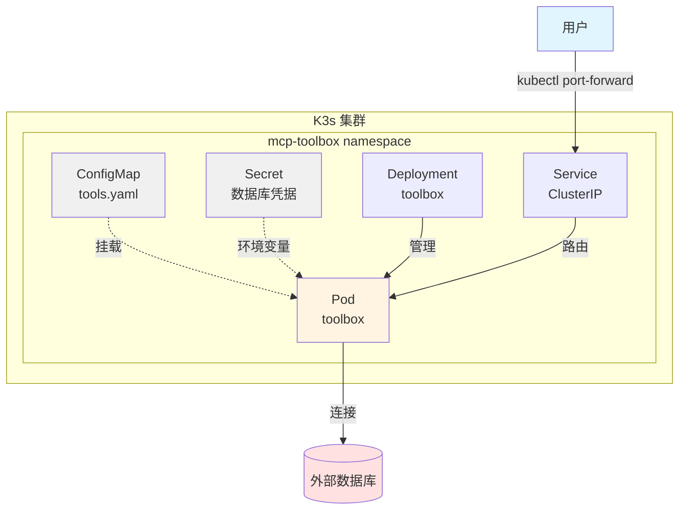
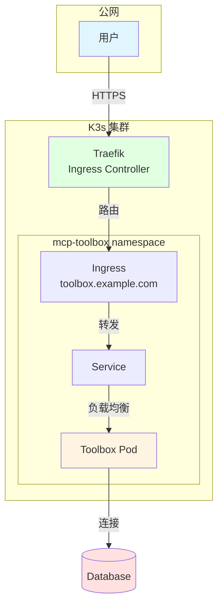
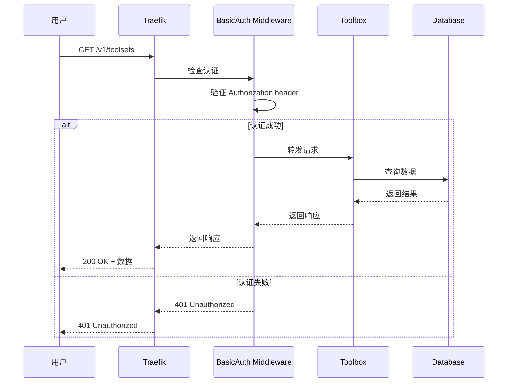
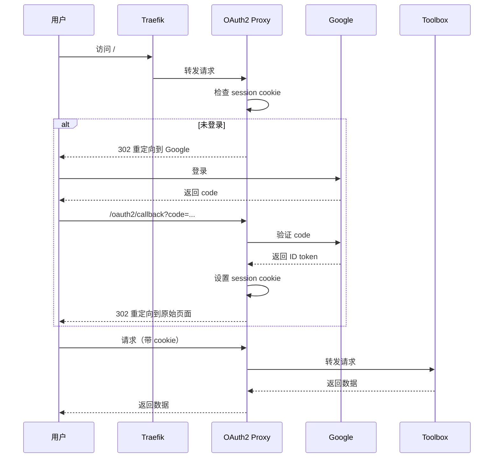
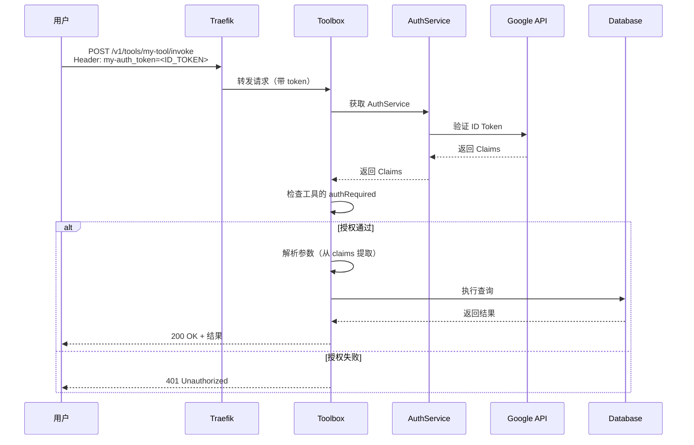
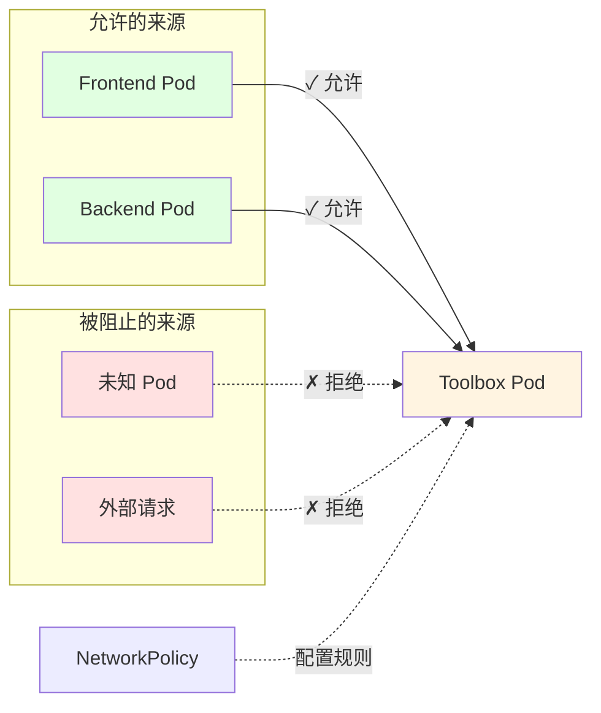
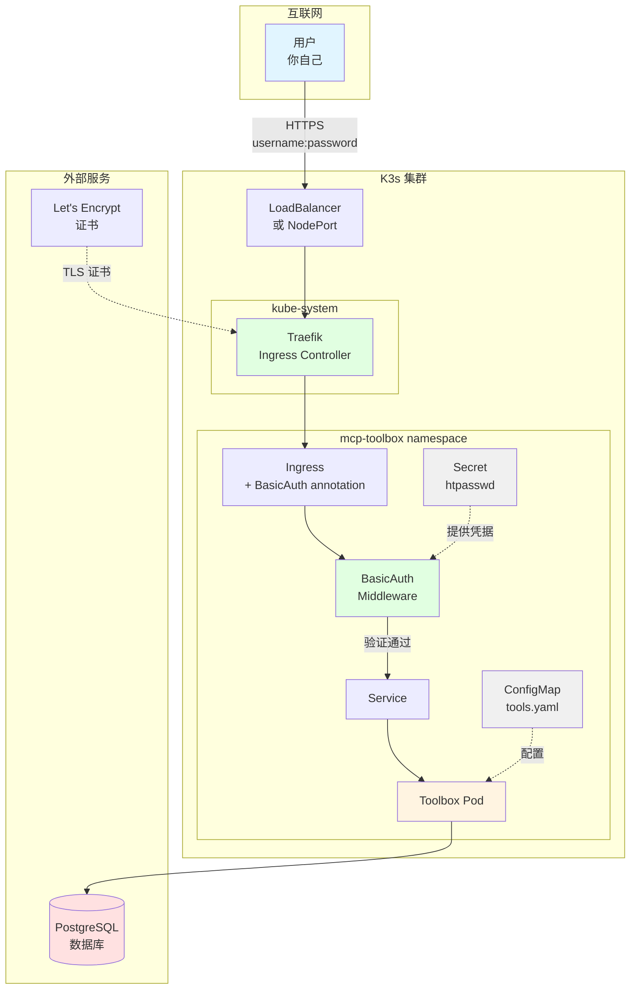
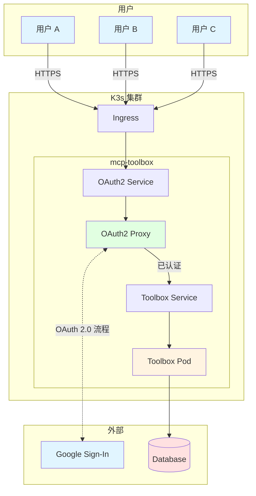
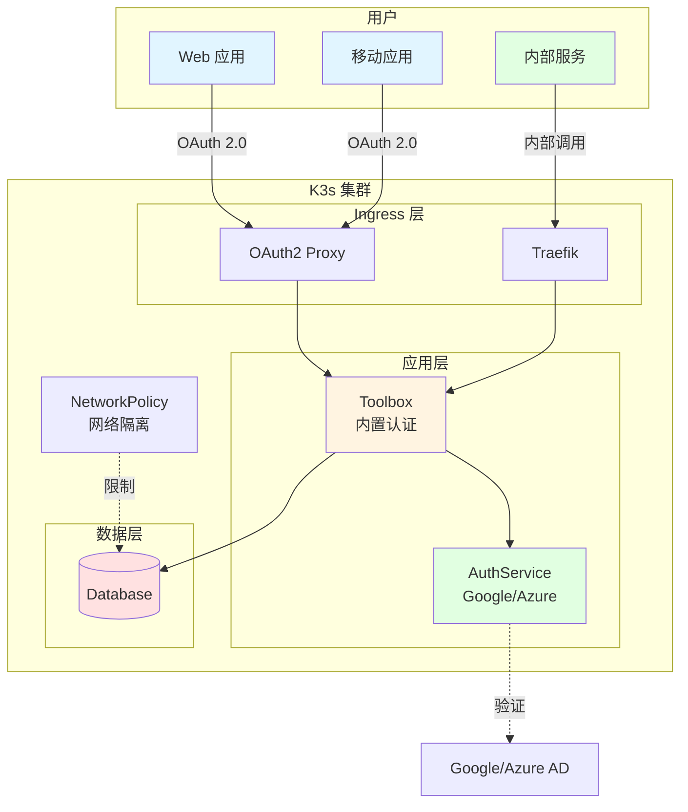
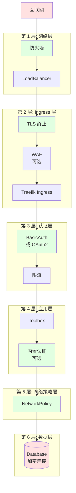

# MCP Toolbox K8s 架构设计

本文档详细说明 MCP Toolbox 在 Kubernetes 环境中的部署架构和认证方案。

## 目录

1. [基础架构](#1-基础架构)
2. [认证方案对比](#2-认证方案对比)
3. [推荐架构](#3-推荐架构)
4. [高可用架构](#4-高可用架构)
5. [安全最佳实践](#5-安全最佳实践)

---

## 1. 基础架构

### 1.1 最小化部署



**适用场景**: 
- 本地开发
- 内网测试
- 无需外部访问

**部署命令**:
```bash
kubectl apply -f k8s/base/
kubectl port-forward svc/toolbox 5000:5000 -n mcp-toolbox
```

---

### 1.2 标准部署（带 Ingress）



**适用场景**: 
- 需要外部访问
- 有域名
- 基础部署

---

## 2. 认证方案对比

### 2.1 Traefik BasicAuth（推荐）



**认证流程**:
1. 用户请求带 `Authorization: Basic <base64(user:pass)>` header
2. Traefik 接收请求
3. BasicAuth Middleware 从 Secret 读取 htpasswd
4. 验证用户名和密码
5. 验证通过则转发，失败则返回 401

**配置复杂度**: ⭐ (最简单)

---

### 2.2 OAuth2 Proxy



**认证流程**:
1. 用户首次访问被重定向到 Google 登录
2. 登录成功后 OAuth2 Proxy 设置 session cookie
3. 后续请求通过 cookie 验证
4. Token 自动刷新

**配置复杂度**: ⭐⭐ (中等)

---

### 2.3 Toolbox 内置认证



**认证流程**:
1. 用户请求带 `{authService}_token: <ID_TOKEN>` header
2. Toolbox 使用 Google API 验证 token
3. 提取 claims (email, sub, etc.)
4. 检查工具的 `authRequired` 配置
5. 自动填充带 `authServices` 的参数
6. 执行工具

**配置复杂度**: ⭐⭐⭐ (较复杂)

---

### 2.4 NetworkPolicy



**工作原理**:
- Kubernetes 网络层面的访问控制
- 基于 namespace、Pod label 或 IP 范围
- 不验证用户身份，只控制网络连接

**配置复杂度**: ⭐ (最简单，但功能有限)

---

## 3. 推荐架构

### 3.1 个人使用 - Traefik BasicAuth



**特点**:
- 简单可靠
- 性能优秀
- 易于维护

**一键部署**:
```bash
cd k8s/ingress/basic-auth/ && ./deploy-basic-auth.sh
```

---

### 3.2 团队使用 - OAuth2 Proxy



**特点**:
- Google 账号管理
- 用户体验好
- 适合团队协作

---

### 3.3 企业使用 - 组合方案



**特点**:
- 多层认证
- 细粒度权限
- 网络隔离

---

## 4. 高可用架构

### 4.1 多副本 + 负载均衡

```yaml
# 高可用 Deployment 配置
apiVersion: apps/v1
kind: Deployment
metadata:
  name: toolbox
  namespace: mcp-toolbox
spec:
  replicas: 3  # 多副本
  strategy:
    type: RollingUpdate
    rollingUpdate:
      maxSurge: 1
      maxUnavailable: 1
  selector:
    matchLabels:
      app: toolbox
  template:
    metadata:
      labels:
        app: toolbox
    spec:
      # Pod 反亲和性（分散到不同节点）
      affinity:
        podAntiAffinity:
          preferredDuringSchedulingIgnoredDuringExecution:
          - weight: 100
            podAffinityTerm:
              labelSelector:
                matchLabels:
                  app: toolbox
              topologyKey: kubernetes.io/hostname
      
      containers:
      - name: toolbox
        image: toolbox:0.30.0
        # ... 其他配置
```

### 4.2 水平自动扩缩容（HPA）

```yaml
apiVersion: autoscaling/v2
kind: HorizontalPodAutoscaler
metadata:
  name: toolbox-hpa
  namespace: mcp-toolbox
spec:
  scaleTargetRef:
    apiVersion: apps/v1
    kind: Deployment
    name: toolbox
  minReplicas: 2
  maxReplicas: 10
  metrics:
  - type: Resource
    resource:
      name: cpu
      target:
        type: Utilization
        averageUtilization: 70
  - type: Resource
    resource:
      name: memory
      target:
        type: Utilization
        averageUtilization: 80
```

### 4.3 持久化和备份

```yaml
# PVC for configuration backups
apiVersion: v1
kind: PersistentVolumeClaim
metadata:
  name: toolbox-config-backup
  namespace: mcp-toolbox
spec:
  accessModes:
  - ReadWriteOnce
  resources:
    requests:
      storage: 1Gi
---
# CronJob for periodic backups
apiVersion: batch/v1
kind: CronJob
metadata:
  name: toolbox-config-backup
  namespace: mcp-toolbox
spec:
  schedule: "0 2 * * *"  # 每天凌晨 2 点
  jobTemplate:
    spec:
      template:
        spec:
          containers:
          - name: backup
            image: bitnami/kubectl:latest
            command:
            - /bin/sh
            - -c
            - |
              kubectl get configmap toolbox-config -n mcp-toolbox -o yaml > /backup/config-$(date +%Y%m%d).yaml
              kubectl get secret toolbox-secrets -n mcp-toolbox -o yaml > /backup/secret-$(date +%Y%m%d).yaml
              # 保留最近 7 天的备份
              find /backup -mtime +7 -delete
            volumeMounts:
            - name: backup
              mountPath: /backup
          restartPolicy: OnFailure
          volumes:
          - name: backup
            persistentVolumeClaim:
              claimName: toolbox-config-backup
```

---

## 5. 安全最佳实践

### 5.1 纵深防御架构



### 5.2 安全检查清单

#### 网络安全
- [ ] 启用 HTTPS/TLS
- [ ] 使用有效的 TLS 证书（Let's Encrypt）
- [ ] 配置 HTTPS 重定向
- [ ] 限制访问源 IP（如适用）
- [ ] 启用 NetworkPolicy

#### 认证和授权
- [ ] 启用认证（BasicAuth 或 OAuth2）
- [ ] 使用强密码（至少 16 位）
- [ ] 定期轮换密码（建议 90 天）
- [ ] 限制用户数量（最小权限原则）
- [ ] 启用审计日志

#### 应用安全
- [ ] 使用非 root 用户运行容器
- [ ] 启用 Pod Security Standards
- [ ] 配置资源限制
- [ ] 使用只读根文件系统（如可能）
- [ ] 禁用特权提升

#### 数据安全
- [ ] 使用 Secrets 存储敏感信息
- [ ] 启用数据库加密连接
- [ ] 定期备份配置
- [ ] 加密存储敏感数据
- [ ] 配置数据保留策略

#### 监控和响应
- [ ] 启用访问日志
- [ ] 配置告警规则
- [ ] 监控异常访问
- [ ] 制定事件响应计划
- [ ] 定期安全审计

---

## 6. 部署架构选择指南

### 场景 1: 个人开发者

**需求**: 
- 1 个用户
- 偶尔访问
- 成本敏感

**推荐架构**:
```
用户 → Traefik BasicAuth → Toolbox (1 replica) → Database
```

**部署**: `k8s/ingress/basic-auth/`

---

### 场景 2: 小团队（2-10 人）

**需求**:
- 多个用户
- 日常使用
- 需要基本安全

**推荐架构**:
```
团队成员 → OAuth2 Proxy (Google SSO) → Toolbox (2 replicas) → Database
```

**部署**: `k8s/ingress/oauth2-proxy/`

---

### 场景 3: 中型团队（10-50 人）

**需求**:
- 多团队
- 不同权限需求
- 需要审计

**推荐架构**:
```
用户 → API Gateway → Toolbox 内置认证 (多 authServices) → Database
      → BasicAuth   → (工具级 + 参数级授权)
```

**部署**: 组合 `ingress/basic-auth/` + Toolbox authServices

---

### 场景 4: 大型组织/企业

**需求**:
- 大规模用户
- 细粒度权限
- 合规要求
- 高可用

**推荐架构**:
```
用户 → API Gateway (Kong) → Service Mesh (Istio/mTLS) → Toolbox (HA) → Database (HA)
      → SSO (Okta/Azure AD)   → NetworkPolicy             → 多副本        → 主从复制
      → WAF                   → 监控和日志                → HPA
```

---

## 7. 成本和性能对比

| 方案 | CPU 开销 | 内存开销 | 延迟增加 | 运维成本 | 年度成本估算* |
|------|---------|----------|----------|----------|--------------|
| **无认证** | 0 | 0 | 0 ms | 低 | $0 |
| **BasicAuth** | <1% | ~10 MB | <1 ms | 低 | $0 |
| **OAuth2 Proxy** | ~5% | ~50 MB | ~10 ms | 中 | ~$50 |
| **Toolbox 内置** | ~3% | ~20 MB | ~20 ms | 中 | $0-100 (Google API 调用) |
| **Service Mesh** | ~15% | ~200 MB | ~5 ms | 高 | ~$500 |

*基于单节点 K3s，中等负载

---

## 8. 迁移路径

### 从无认证迁移到 BasicAuth

**停机时间**: 0 分钟

```bash
# 1. 创建认证配置（不影响现有服务）
kubectl apply -f k8s/ingress/basic-auth/middleware.yaml

# 2. 更新 Ingress（立即生效）
kubectl patch ingress toolbox-ingress -n mcp-toolbox -p \
  '{"metadata":{"annotations":{"traefik.ingress.kubernetes.io/router.middlewares":"mcp-toolbox-toolbox-basic-auth@kubernetescrd"}}}'

# 3. 更新客户端（添加认证 header）
# 4. 完成
```

### 从 BasicAuth 迁移到 OAuth2 Proxy

**停机时间**: ~5 分钟

```bash
# 1. 部署 OAuth2 Proxy
kubectl apply -f k8s/ingress/oauth2-proxy/

# 2. 更新 Ingress backend（指向 OAuth2 Proxy）
# 3. 测试
# 4. 删除 BasicAuth 配置
```

### 从 OAuth2 Proxy 迁移到 Toolbox 内置认证

**停机时间**: ~10 分钟

```bash
# 1. 配置 authServices 在 tools.yaml
# 2. 更新 Toolbox Deployment
# 3. 更新客户端（添加 ID token header）
# 4. 删除 OAuth2 Proxy
```

---

## 9. 参考资料

### 项目文档

- [K8s 部署总览](README.md)
- [5 分钟快速开始](QUICKSTART.md)
- [认证功能调研报告](../MCP_认证功能调研报告.md)
- [BasicAuth 详细指南](ingress/basic-auth/README.md)
- [客户端示例](examples/README.md)

### 外部资源

- [K3s 官方文档](https://docs.k3s.io/)
- [Traefik 文档](https://doc.traefik.io/traefik/)
- [OAuth2 Proxy 文档](https://oauth2-proxy.github.io/oauth2-proxy/)
- [Kubernetes NetworkPolicy](https://kubernetes.io/docs/concepts/services-networking/network-policies/)
- [Istio 安全](https://istio.io/latest/docs/concepts/security/)

---

**文档版本**: 1.0  
**最后更新**: 2026-03-20  
**维护者**: MCP Toolbox Community
